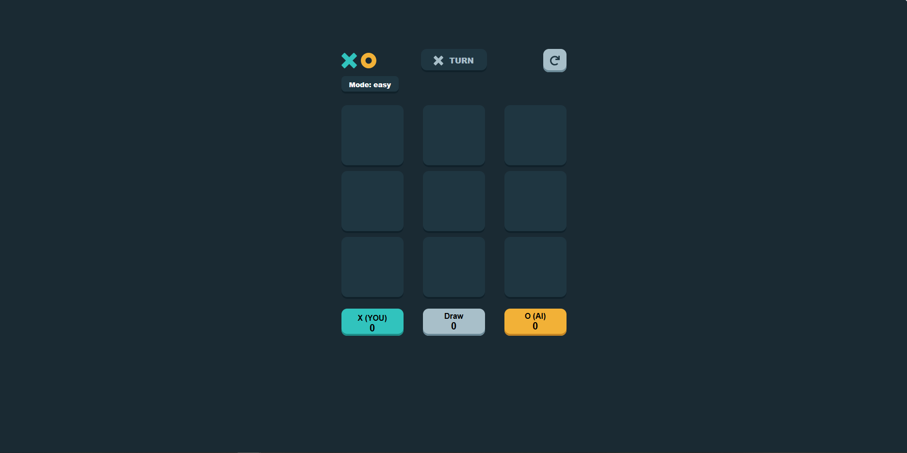
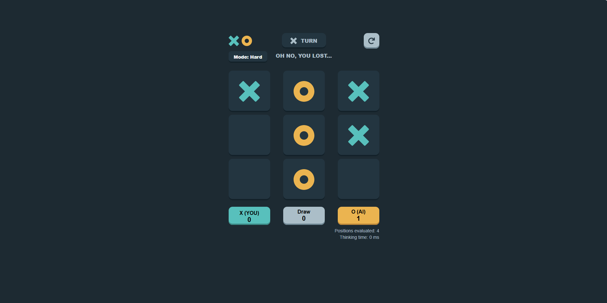

# Tic-Tac-Toe AI

A web-based Tic-Tac-Toe game built with React (or similar) where you can play against an AI opponent.
Choose between different difficulty levels and test your skills.

---

## 🚀 Setup Instructions

Follow these steps to run the project locally:

1. **Clone the repository**

   ```bash
   git clone https://github.com/dattv23/tic-tac-toe-ai.git
   cd tic-tac-toe-ai
   ```

2. **Install dependencies**

   ```bash
   npm install
   # or
   yarn install
   ```

3. **Start the development server**

   ```bash
   npm run dev
   # or
   yarn dev
   ```

   This should launch the app in your browser (typically at `http://localhost:3000` or similar).

4. **Build for production**

   ```bash
   npm run build
   # or
   yarn build
   ```

   The built assets will be output into a `dist/` or `build/` folder (depending on your setup).

5. **Run in production mode (optional)**

   ```bash
   npm run serve
   # or
   yarn serve
   ```

   (Only if you have a serve script configured.)

---

## 🎮 How to Play

- When the app starts, you’ll see a 3×3 grid (the classic Tic-Tac-Toe board).
- You play as **X**, and the AI plays as **O**.
- Click (or tap) an empty square to place your **X**.
- After your move, if it’s your turn again, keep playing; otherwise the AI will make its move.
- The _Mode_ selector allows you to choose between difficulty settings (see the next section).
- The header displays whose turn it is, and when the game ends, it shows whether you won (“YOU WON!”), lost (“OH NO, YOU LOST…”), or drew (“ROUND DRAW!”).
- Press the **Restart** button (↻) to clear the board and start a new game.
- Select a different mode if you want a change in difficulty.

---

## 🧠 Explanation of AI Difficulty Levels

The project supports at least two AI difficulty levels (e.g., **Easy** and **Hard**). Here’s how they differ:

### Easy

- The AI picks moves more simply (e.g., random available spots or shallow look-ahead).
- It's designed to be beatable — good for casual play or learning the rules.
- You’ll see sub-optimal decisions from the AI, giving you more chance to win.

### Hard

- The AI uses a more sophisticated strategy (e.g., deeper minimax search, heuristics, or smarter blocking/forcing tactics).
- It analyses more “positions evaluated” and may take slightly longer to make a move.
- The goal here is to **challenge you**; expect draws or losses if you don’t play carefully.

> Note: If metrics are added (positions evaluated, thinking time), you might display them when Hard mode is selected.

---

## 🧩 Additional Features & Notes

- Mode selector: switch between Easy / Hard via the header menu.
- Metrics (optionally) display after each AI move: number of positions evaluated, and time taken in milliseconds.
- Responsive UI: works in mobile and desktop viewports.
- Clean board state management using React hooks, and win/draw detection via a utility (e.g., `calculateWinner`).
- Ability to reset game at any time with the Restart button.

---

## 📂 Project Structure (Typical)

```
/src
  /components
    GameHeader.tsx
    GameBoard.tsx
    GameScores.tsx
  /utils
    calculateWinner.ts
    ai.ts     # getBestMove, difficulty logic
  App.tsx
  index.tsx
package.json
README.md
```

Adjust the structure above if your repo differs.

---

## 🧪 Running Tests (if applicable)

If you have tests setup, run them via:

```bash
npm run test
# or
yarn test
```

---

## 🤝 Contributing

Feel free to fork the repo, create branches for features/bug-fixes, and submit pull requests.
Please ensure code is well-formatted, commented, and accompanied by relevant tests if applicable.

---

## 🎨 Screenshot



